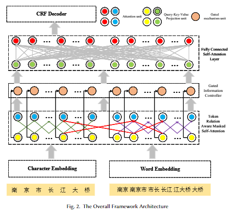
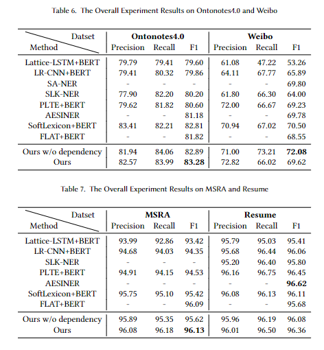

*<u>The project is supervised by [Prof. Wenge Rong](https://wgrong.github.io/) of Beihang University.</u>*

Chinese NER is more complicated due to the lack of explicit delimiters between words. Thus, a lot of character-based approaches have been developed. But it still needs to be supplemented with word-level information. To this end, many existing character-based methods first obtain the lattice structure by matching the latent words from an external lexicon and then leverage their information. But there is still some room to improve. 

First, in most previous works, the latent word embedding is still non-local contextualized (the same word in different contexts shares the same representation), whereas the comprehension of Chinese words heavily depends on its local context.  Besides, the main dynamic word embedding such as BERT are token-level (character for Chinese) and are not suitable for encoding latent words, which induces the contextualization of latent word embedding a challenging task. 

Second, the Transformer's fully-connected attention is directly utilized for encoding, thus the encoder treats all characters and latent words equally and probably attends to some irrelevant words. This requires the model to learn to select useful relations from many redundant ones.

Therefore, In this project, our goal is to answer the following two questions: (1) how to establish the local context for latent words, and (2) how to help the model select the useful relations among tokens. 

To these ends, we investigated three relations, i.e, adjacent relations between characters, character co-occurrence relations between latent words, and dependency relations among tokens. Among them, the latter two are helpful when constructing the local context for latent words and all three of them are devoted to strengthening the connections between those strongly related tokens. However, integrating these relations across different levels into the character-based Chinese NER model is challenging. Taking the dependency relation as an example, the previous works that utilize dependency results to enhance their NER model are almost word-level. But the word-based model either requires gold word segmentation results as input or needs to do word segmentation task first, which could cause the error propagation. 

To address this issue, we adopt FLAT‘s approach for representing the lattice structure and propose a masked attention mechanism to leverage the relationships across different levels. Specifically, the attention score is solely calculated between the tokens connected with the three aforementioned relations. The proposed mechanism could help the model more effectively learn by masking some immaterial tokens and underlining the important ones.

The experimental results on four widely used datasets prove the promising effectiveness of our method.

### Latest

We conclude the method and experimental results in this project into an academic paper, and it is accepted by [ACM TRANSACTIONS ON ASIAN AND LOW-RESOURCE LANGUAGE INFORMATION PROCESSING](https://dl.acm.org/journal/tallip).  

