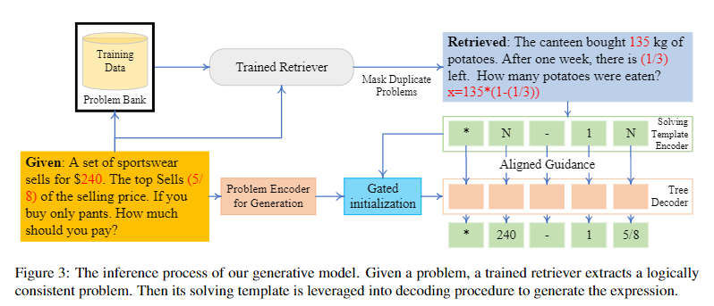
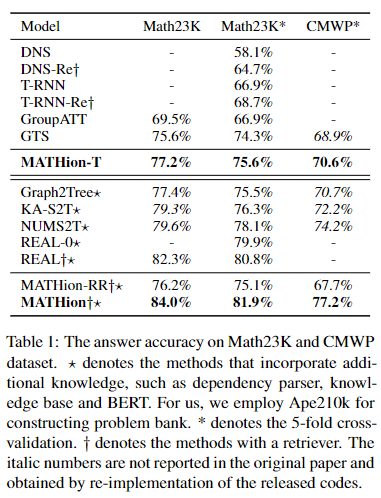
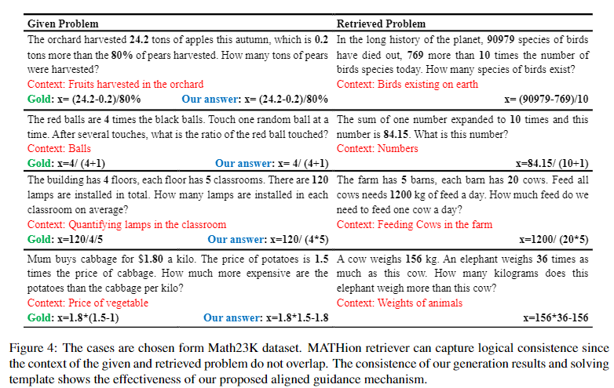

Solving math word problems (MWPs) is a challenging task. Some existing solvers retrieve textually similar problems and draw on their solutions to solve the given problem. However, textually similar questions are not guaranteed to have similar solutions. Furthermore, questions could share the same solution template but with different descriptions. Therefore in this project, we investigate the logical consistency among different problems.

In this project, we propose MATHion, a contrastive learning-based “retrieve-then-generate” approach, which solves math word problems with logically consistent problems. Compared with previous methods, we employ contrastive learning to train the retriever to mainly focus on the logical consistency instead of textual similarity when extracting similar problems. Besides, we propose a gated initialization and an aligned guidance mechanism, thus the model could regard the solving template of the problem retrieved as hints in each generation step to produce the final expression.Solving math word problems (MWPs) is a challenging task. Some existing solvers retrieve textually similar problems and draw on their solutions to solve the given problem. However, textually similar questions are not guaranteed to have similar solutions. Furthermore, questions could share the same solution template but with different descriptions. Therefore in this project, we investigate the logical consistency among different problems.

Experimental results show that our method outperforms many strong baselines, including some pre-trained language model-based methods. Further analysis shows that our retrieval method does learn the logical similarity between questions and plays a key role in our model's performance.

**Case Study**: To illustrate that our retriever does partially see through the narrative description and perceive the intrinsic logic, we give four cases shown in. We observe that the given problems and retrieved problems do not always share similar contexts but the consistent logic. 

### A Paper List for Math Word Problem

This is a paper list for math word problem. It also contains some related research areas, including geometry problem solving.

`Keyword`: Math Word Problem, Geometry Problem, Natural Language Processing

### Dataset

* Deep Neural Solver for Math Word Problems, EMNLP2017, [[paper]](https://aclanthology.org/D17-1088.pdf)
  * Math23k, include 23161 problems. (Chinese)
* Ape210K: A Large-Scale and Template-Rich Dataset of Math Word Problems, arxiv,  [[paper]](https://arxiv.org/abs/2009.11506) [[code]](https://github.com/Chenny0808/ape210k)
  * Ape210K, include 210488 problems. (Chinese, largest)
* A Diverse Corpus for Evaluating and Developing English Math Word Problem Solvers, ACL2020, [[paper]](https://arxiv.org/pdf/2106.15772.pdf) [[code]](https://github.com/chaochun/nlu-asdiv-dataset)
  * ASDiv, cover more text patterns, include 2305 problems. (English)

### Math Word Problem Solvers

* Recall and Learn: A Memory-augmented Solver for Math Word Problems, EMNLP2021 Findings,  [[paper]](https://aclanthology.org/2021.findings-emnlp.68.pdf) [[code]](https://github.com/sfeng-m/REAL4MWP) 
* Improving Math Word Problems with Pre-trained Knowledge and Hierarchical Reasoning, EMNLP2021, [[paper]](https://aclanthology.org/2021.emnlp-main.272.pdf)
* An Edge-Enhanced Hierarchical Graph-to-Tree Network for Math Word Problem Solving, EMNLP2021 Findings, [[paper]](https://aclanthology.org/2021.findings-emnlp.127.pdf) [[code]](https://github.com/qinzhuowu/EEH_G2T)
* Generate & Rank: A Multi-task Framework for Math Word Problems, EMNLP2021 Findings, [[paper]](https://aclanthology.org/2021.findings-emnlp.195.pdf)  [[code]](https://github.com/huawei-noah/noah-research)
* Math Word Problem Solving with Explicit Numerical Values, ACL2021, [[paper]](https://aclanthology.org/2021.acl-long.455.pdf)  [[code]](https://github.com/qinzhuowu/nums2t)
* Neural-Symbolic Solver for Math Word Problems with Auxiliary Tasks, ACL2021, [[paper]](https://aclanthology.org/2021.acl-long.456.pdf)  [[code]](https://github.com/QinJinghui/NS-Solver)
* Sequence to General Tree: Knowledge-Guided Geometry Word Problem Solving, ACL2021 short paper, [[paper]](https://aclanthology.org/2021.acl-short.121.pdf)  [[code]](https://github.com/doublebite/Sequence-to-General-tree/)
* Measuring Mathematical Problem Solving With the MATH Dataset, NIPS2021, [[paper]](https://arxiv.org/pdf/2103.03874.pdf) [[code]](https://github.com/hendrycks/math)
* Are NLP Models really able to Solve Simple Math Word Problems, NAACL2021, [[paper]](https://arxiv.org/pdf/2104.06722.pdf) [[code]](https://github.com/arkilpatel/SVAMP)
* Learning by Fixing- Solving Math Word Problems with Weak Supervision, AAAI2021, [[paper]](https://arxiv.org/pdf/2012.10582.pdf) [[code]](https://github.com/evelinehong/LBF)
* Reverse Operation based Data Augmentation for Solving Math Word Problems, TASLP2021, [[paper]](https://arxiv.org/pdf/2010.01556.pdf) [[code]](https://github.com/yiyunya/RODA)
* Semantically-Aligned Universal Tree-Structured Solver for Math Word Problems, EMNLP2020, [[paper]](https://aclanthology.org/2020.emnlp-main.309.pdf) [[code]](https://github.com/QinJinghui/SAU-Solver)
* A Knowledge-Aware Sequence-to-Tree Network for Math Word Problem Solving, EMNLP2020, [[paper]](https://aclanthology.org/2020.emnlp-main.579.pdf)
* Graph-to-Tree Neural Networks for Learning Structured Input-Output Translation with Applications to Semantic Parsing and Math Word Problem, EMNLP2020 Findings, [[paper]](https://aclanthology.org/2020.findings-emnlp.255.pdf)
* Graph-to-Tree Learning for Solving Math Word Problems, ACL2020, [[paper]](https://aclanthology.org/2020.acl-main.362.pdf) [[code]](https://github.com/2003pro/Graph2Tree)
* Teacher-Student Networks with Multiple Decoders for Solving Math Word Problem, IJCAI2020, [[paper]](https://www.ijcai.org/proceedings/2020/0555.pdf) [[code]](https://github.com/2003pro/TSN-MD)
* Modeling Intra-Relation in Math Word Problems with Different Functional Multi-Head Attentions, ACL2019, [[paper]](https://aclanthology.org/P19-1619.pdf) [[code]](https://github.com/lijierui/group-attention)
* A Goal-Driven Tree-Structured Neural Model for Math Word Problems, IJCAI2019, [[paper]](https://www.ijcai.org/proceedings/2019/0736.pdf) [[code]](https://github.com/ShichaoSun/math_seq2tree)
* Template-Based Math Word Problem Solvers with Recursive Neural Networks, AAAI2019, [[paper]](https://tongtianta.site/oss//paper_pdf/5cbadb30-2ca0-11eb-9da8-00163e0d281a_4d28ea7a950f4f393767d0f2ad5e58d6.pdf)  [[code]](https://github.com/uestc-db/T-RNN)
* MathQA- Towards Interpretable Math Word Problem Solving with Operation-Based Formalisms, NAACL2019, [[paper]](https://aclanthology.org/N19-1245.pdf) [[code]](https://math-qa.github.io/math-QA/)
* The Gap of Semantic Parsing- A Survey on Automatic Math Word Problem Solvers, TPAMI2019, [[paper]](https://arxiv.org/pdf/1808.07290.pdf)
* Translating a Math Word Problem to an Expression Tree, ACL2018, [[paper]](https://aclanthology.org/D18-1132.pdf)
* A Meaning-based Statistical English Math Word Problem Solver, NAACL2018, [[paper]](https://aclanthology.org/N18-1060.pdf) [[code]](https://github.com/chaochun/nlu-mwp-noise-dataset)
* MathDQN: Solving Arithmetic Word Problems via Deep Reinforcement Learning, AAAI2018, [[paper]](https://www.aaai.org/ocs/index.php/AAAI/AAAI18/paper/view/16749/16111) [[code]](https://github.com/uestc-db/DQN_Word_Problem_Solver)
* Mapping to Declarative Knowledge for Word Problem Solving, TACL2018, [[paper]](https://aclanthology.org/Q18-1012.pdf) [[code]](https://github.com/CogComp/arithmetic)
* A Weakly Supervised Model for Solving Math word Problems, arxiv-2021, [[paper]](https://arxiv.org/pdf/2104.06722.pdf)
* MWP-BERT: A Strong Baseline for Math Word Problems, arxiv-2021, [[paper]](https://arxiv.org/pdf/2107.13435.pdf)
* Investigating Math Word Problems using Pretrained Multilingual Language Models, arxiv-2021, [[paper]](https://arxiv.org/pdf/2105.08928.pdf)
* MWPToolkit- An Open-source Framework for Deep Learning-based Math Word Problem Solvers, arxiv-2021, [[paper]](https://arxiv.org/pdf/2109.00799.pdf) [[code]](https://github.com/LYH-YF/MWPToolkit)

### Latest

We conclude the method and experimental results in this project into an academic paper and submit to ***ACL 2022*** .

However, it was rejected with a borderline score (**3/5**) due to the unfair comparison  in experiments.😶

We are now working on ameliorate this project for future submission!

