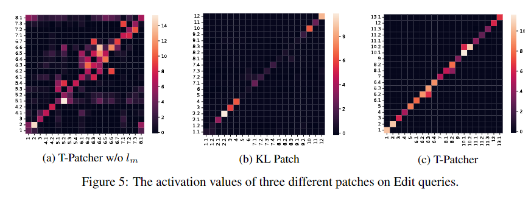

Transformer-based models, particularly large Pretrained Language Models (PLMs) have become the core of modern Natural Language Processing (NLP) and have enabled promising results in various downstream tasks. However, models still inevitably make mistakes and undesirable outputs occasionally. The cost of such mistakes is non-negligible, e.g., a mistaken automatic translation result could get a person arrested. One of the most usual expedients was using a manual cache (e.g., lookup table) to overrule these problematic predictions. 

Though convenient and straightforward, it lacks robustness and generality for being ineffective with the slightest change in the input, such as paraphrasing in natural language. Otherwise, one can also re-train the model on the original dataset supplemented with problematic examples. While superior in performance, it is computationally and temporally expensive to re-train large PLMs with billions or even trillions of parameters. 

Motivated by the problems mentioned above, we define a new task, **Sequential Model Editing(SME)**. As shown in Figure, it requires a model editor to fix a series of mistakes one after another.

For each editing, the post-edit model should satisfy: 1) Reliability: make the desirable output; 2) Generality: generalize over other equivalent inputs; 3) Locality: retain its behavior over irrelevant inputs. We then propose a standard SME experiment pipeline compatible with different tasks and five evaluation metrics to evaluate the three properties. 

Experimental results on Fact-checking and Closed-book Question Answering show that most existing one-step editors had trouble making effective edits in the SME setting . Fine-tuning-based methods make the model vulnerable to forgetting previous edits. HyperNetwork-based editors strongly coupled with the original parameters, thus failing to edit the model after several steps.

We introduced **Transformer-Patcher (T-Patcher)**. Unlike previous methods, Transformer-Patcher retains all original parameters to prevent harming the model's overall performance. It only adds a handful of trainable neurons (patches) in the last Feed-Forward Network (FFN) layer to revise the model's behavior on the problematic input and achieve a low editing cost. Furthermore, we propose an activation loss and a memory loss for training the patch to respond to specific inputs only. Experimental results on fact-checking and question answering indicated that Transformer-Patcher could rectify a series of mistakes (up to thousands) while almost perfectly retaining the model's behavior on irrelevant inputs.

For a vivid illustration, we choose visualize the activation values of added neurons on Edit example. The X-axis represents the example to edit, and the Y-axis represents the added neurons. Figure c presents a clear diagonal line, which means each neuron takes charge of the specific mistake.

**Paper list for Model Editing**

*to do*

**Latest**

We conclude the method and experimental results in this project into an academic paper, and submit it to [Neurips 2022](https://neurips.cc/). 

Good luck to us. 🙌

